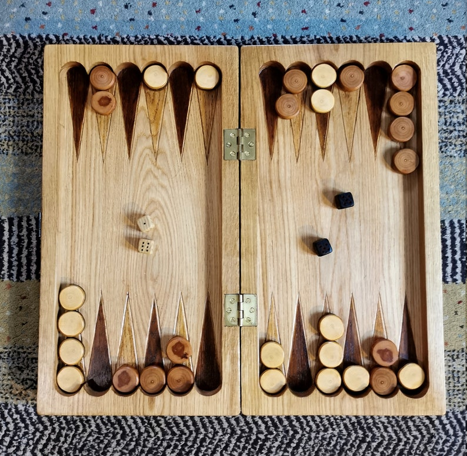

<!DOCTYPE html>
<html>      
<head>

    <h1 class=nom style="color:rgb(255, 255, 255);"  font-weight=bold  align = "center"> ALB-28  </h1>
    <meta charset="utf-8">
    <link rel="stylesheet" href="page.css">
</head>
<body background="bn1.jpg">
  

    <button class="boutonmenu">&nbsp;&nbsp;Menu&nbsp;&nbsp;</button>
    

    <a href="modelesite.html">Accueil</a>
    <a href="type1.html">Jeux de cartes</a>
    <a href="type2.html">Jeux de plateau</a>
    <a href="type3.html">Figurines</a>
    <a href="test2.html">Se connecter</a>
    <a href="test1.html">S'inscrire</a>
    <a href="nouscont.html">Nous contacter</a>
    

<!-- 

  
test 1

  
test 1

-->

<h1 class="encadrer" style="color:rgb(255, 255, 255)"  font-weight=bold   align = "center">Accueil</h1>
  

<h2 class="text" style="color: rgb(168, 156, 92);"> Bienvenue chez ALB-28,</h2>
<h2 class="text" style="color: rgb(168, 156, 92);">
Depuis notre création en 1992 nous n'avons cessé 
de proposer à nos utilisateurs les meilleurs produits. Retrouvez sans attendre nos jeux de cartes de qualité imbattable 
ou encore nos magnifiques figurines. N'hesitez pas à consulter notre toute nouvelle collection de jeu de société.
</h2>

  
  

    <a align=center href="type1.html">
    

    <h2 style="color: rgb(255,255,255)">Nos jeux de cartes</h2>
    </a>
  

  

    <a align=center href="type2.html">
    

    <h2 style="color: rgb(255,255,255)">Nos jeux de plateau</h2>
    </a>
  

  

    <a align=center href="type3.html">
    

    <h2 style="color: rgb(255,255,255)">Nos figurines</h2>
    </a>
  

    

</body>
</html>
